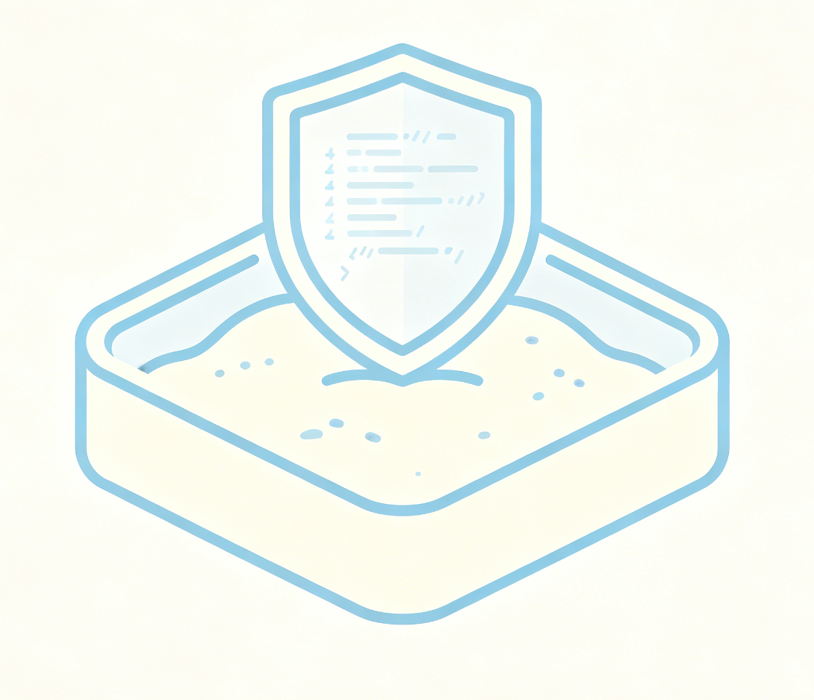

<p align="center">
  
</p>

<h1 align="center">NexusBox</h1>

<p align="center">
  <strong>Enterprise-Grade AI Agent Sandbox with MCP Integration</strong>
</p>

<p align="center">
  <a href="README_zh.md">中文</a> &bull;
  <a href="#features">Features</a> &bull;
  <a href="#architecture">Architecture</a> &bull;
  <a href="#quick-start">Quick Start</a> &bull;
  <a href="#docker-deployment">Docker Deployment</a> &bull;
  <a href="#mcp-tools">MCP Tools</a> &bull;
  <a href="#trae-integration">Trae Integration</a> &bull;
  <a href="#api-reference">API Reference</a> &bull;
  <a href="#security">Security</a> &bull;
  <a href="#multi-tenancy">Multi-Tenancy</a>
</p>

<p align="center">
  <a href="docs/quick-start-guide.md">Quick Start Guide (EN)</a> &bull;
  <a href="docs/quick-start-guide_zh.md">快速启动指南 (中文)</a>
</p>

---

## What is NexusBox?

NexusBox is an **enterprise-grade sandbox platform** designed for AI Agents. It provides a fully isolated execution environment where AI agents can perform real operations — executing shell commands, reading/writing files, running code, and automating browsers — **without any risk to the host machine**.

Unlike simple demo sandboxes that only support `curl` or `docker exec`, NexusBox implements the **Model Context Protocol (MCP)** to expose 18 real tools that AI agents can call autonomously. When integrated with AI coding assistants like Trae, Claude Desktop, or Cursor, NexusBox transforms them from text generators into **autonomous agents** that can safely execute dangerous operations in an isolated workspace.

### Why NexusBox?

| Problem | NexusBox Solution |
|---------|-------------------|
| AI agents can't execute real commands | 18 MCP tools for shell, file, code, browser operations |
| Running AI-generated code risks the host | Workspace isolation with path traversal protection |
| No standard protocol for agent-tool interaction | MCP (Model Context Protocol) — industry standard |
| Demo sandboxes only support `curl` | Full development environment: Python, Node.js, Chromium, Jupyter, VS Code |
| No multi-tenant isolation | Per-tenant workspace, network policy, resource quotas |
| Black-box execution, no observability | Health checks, structured logging, Prometheus metrics |

---

## Features

### Core Capabilities

- **Shell Execution** — Run any shell command synchronously or in the background, with timeout control
- **File Operations** — Read, write, list, search, replace, delete, and move files within the sandbox workspace
- **Code Execution** — Run Python and Node.js code with temporary file handling and timeout limits
- **Browser Automation** — Navigate, screenshot, click, type, and evaluate JavaScript via CDP (Chrome DevTools Protocol)
- **Port Proxy** — Forward HTTP traffic into the sandbox for web service testing

### Enterprise Features

- **MCP (Model Context Protocol)** — JSON-RPC 2.0 standard interface for AI agent integration
- **Multi-Tenant Isolation** — Per-tenant workspace, network policies, and resource quotas
- **Security Hardening** — Path traversal protection, capability dropping, rootless mode, seccomp
- **Full Development Environment** — JupyterLab, code-server (VS Code in browser), Chromium, noVNC desktop
- **Observability** — Health checks, structured logging with rotation, Prometheus metrics, audit logging
- **Graceful Lifecycle** — State machine management, graceful shutdown with resource cleanup

---

## Quick Start

### Option 1: Native Binary (Fast, No Docker)

Prerequisites: [Go 1.22+](https://go.dev/dl/)

```bash
# Clone the repository
git clone https://github.com/nexusbox/nexusbox.git
cd nexusbox

# Set Go proxy (China users)
export GOPROXY=https://goproxy.cn,direct

# Build
go build -o nexusbox-agent ./cmd/sandbox-dev

# Run
./nexusbox-agent \
  -port=8080 \
  -mcp-port=8079 \
  -proxy-port=6081 \
  -workspace=/path/to/your/workspace \
  -log-level=info
```

### Option 2: Docker Compose (Full Environment)

See [Docker Deployment](#docker-deployment) below.

### Verify

```bash
# Health check
curl http://localhost:8080/healthz
# Expected: ok

# List MCP tools
curl -X POST http://localhost:8079/mcp \
  -H "Content-Type: application/json" \
  -d '{"jsonrpc":"2.0","method":"tools/list","id":1}'

# Execute a shell command via MCP
curl -X POST http://localhost:8079/mcp \
  -H "Content-Type: application/json" \
  -d '{"jsonrpc":"2.0","method":"tools/call","params":{"name":"shell_exec","arguments":{"command":"echo Hello NexusBox && whoami"}},"id":2}'
```

---

## Docker Deployment

### Prerequisites

- Docker 20.10+
- Docker Compose 2.0+

### Build and Start

```bash
cd nexusbox

# Build and start (first build takes ~30 minutes)
docker-compose -f deploy/docker/docker-compose.yaml up --build -d

# View startup logs (wait for "NexusBox Sandbox - Ready")
docker logs -f nexusbox-sandbox

# Health check
curl http://localhost:8080/healthz
```

### Service Ports

| Port | Service | URL | Description |
|------|---------|-----|-------------|
| 8080 | Gateway API | http://localhost:8080 | REST API for all operations |
| 8079 | MCP Hub | http://localhost:8079/mcp | MCP endpoint for AI agents |
| 6080 | noVNC | http://localhost:6080 | Web-based remote desktop |
| 8888 | JupyterLab | http://localhost:8888 | Python notebook environment |
| 8200 | code-server | http://localhost:8200 | VS Code in browser |
| 6081 | Port Proxy | http://localhost:6081/proxy/ | HTTP port forwarding |

### Environment Variables

| Variable | Default | Description |
|----------|---------|-------------|
| `WORKSPACE` | `/home/sandbox` | Sandbox workspace directory |
| `LOG_LEVEL` | `info` | Log level: debug, info, warn, error |
| `HOST_PORT` | `8080` | Gateway API host port mapping |
| `MCP_PORT` | `8079` | MCP Hub host port mapping |
| `VNC_PORT` | `6080` | noVNC host port mapping |
| `JUPYTER_PORT` | `8888` | JupyterLab host port mapping |
| `CODE_SERVER_PORT` | `8200` | code-server host port mapping |
| `PROXY_SERVER` | _(empty)_ | HTTP proxy for outbound requests |
| `JWT_PUBLIC_KEY` | _(empty)_ | JWT public key for authentication |

### Custom Configuration

```bash
# Run with custom ports and workspace
HOST_PORT=9080 MCP_PORT=9079 WORKSPACE=/data/projects \
  docker-compose -f deploy/docker/docker-compose.yaml up -d
```

### Post-Deployment Testing

After the container is running, run these tests to verify all services:

```bash
# 1. Gateway health check
curl http://localhost:8080/healthz
# Expected: ok

# 2. System environment
curl http://localhost:8080/v1/system/env

# 3. List all MCP tools (should return 18 tools)
curl -s -X POST http://localhost:8079/mcp \
  -H "Content-Type: application/json" \
  -d '{"jsonrpc":"2.0","method":"tools/list","id":1}' | python3 -m json.tool

# 4. Execute a shell command
curl -s -X POST http://localhost:8079/mcp \
  -H "Content-Type: application/json" \
  -d '{"jsonrpc":"2.0","method":"tools/call","params":{"name":"shell_exec","arguments":{"command":"uname -a && whoami && pwd"}},"id":2}'

# 5. Write and read a file
curl -s -X POST http://localhost:8079/mcp \
  -H "Content-Type: application/json" \
  -d '{"jsonrpc":"2.0","method":"tools/call","params":{"name":"file_write","arguments":{"path":"test.txt","content":"Hello from NexusBox!"}},"id":3}'

curl -s -X POST http://localhost:8079/mcp \
  -H "Content-Type: application/json" \
  -d '{"jsonrpc":"2.0","method":"tools/call","params":{"name":"file_read","arguments":{"path":"test.txt"}},"id":4}'

# 6. Run Python code
curl -s -X POST http://localhost:8079/mcp \
  -H "Content-Type: application/json" \
  -d '{"jsonrpc":"2.0","method":"tools/call","params":{"name":"code_run","arguments":{"language":"python","code":"import platform; print(f\"Running on {platform.platform()}\")"}},"id":5}'

# 7. Run Node.js code
curl -s -X POST http://localhost:8079/mcp \
  -H "Content-Type: application/json" \
  -d '{"jsonrpc":"2.0","method":"tools/call","params":{"name":"code_run","arguments":{"language":"nodejs","code":"console.log(`Node.js ${process.version} on ${process.platform}`)"}},"id":6}'

# 8. Verify path traversal protection (should be blocked)
curl -s -X POST http://localhost:8079/mcp \
  -H "Content-Type: application/json" \
  -d '{"jsonrpc":"2.0","method":"tools/call","params":{"name":"file_read","arguments":{"path":"../../etc/passwd"}},"id":7}'
# Expected: "path is outside workspace"

# 9. Test Gateway REST API
curl -s -X POST http://localhost:8080/v1/shell/exec \
  -H "Content-Type: application/json" \
  -d '{"command":"ls -la /home/sandbox"}'

curl -s -X POST http://localhost:8080/v1/code/execute \
  -H "Content-Type: application/json" \
  -d '{"language":"python","code":"print(2+3)"}'

# 10. Check noVNC desktop (open in browser)
# http://localhost:6080

# 11. Check JupyterLab (open in browser)
# http://localhost:8888

# 12. Check code-server (open in browser)
# http://localhost:8200
```

### Stop and Cleanup

```bash
# Stop the container
docker-compose -f deploy/docker/docker-compose.yaml down

# Stop and remove volumes (deletes all workspace data)
docker-compose -f deploy/docker/docker-compose.yaml down -v
```

---

## MCP Tools

NexusBox exposes 18 tools via the MCP (Model Context Protocol) endpoint at `http://localhost:8079/mcp`. All tools use JSON-RPC 2.0 format.

### Shell Tools

| Tool | Description | Key Arguments |
|------|-------------|---------------|
| `shell_exec` | Execute a shell command synchronously | `command`, `timeout` (max 300s), `workDir` |
| `shell_background` | Start a long-running command in background | `command`, `id` |
| `shell_check` | Check status of a background command | `id` |

**Example — Execute a command:**
```json
{
  "jsonrpc": "2.0",
  "method": "tools/call",
  "params": {
    "name": "shell_exec",
    "arguments": {
      "command": "git clone https://github.com/example/repo.git && cd repo && make build",
      "timeout": 120,
      "workDir": "/home/sandbox"
    }
  },
  "id": 1
}
```

### File Tools

| Tool | Description | Key Arguments |
|------|-------------|---------------|
| `file_read` | Read file content | `path`, `offset`, `limit` |
| `file_write` | Write content to a file | `path`, `content`, `append` |
| `file_list` | List directory contents | `path`, `recursive` |
| `file_search` | Search for text in files | `path`, `pattern`, `filePattern` |
| `file_replace` | Find and replace text in a file | `path`, `search`, `replace`, `replaceAll` |
| `file_delete` | Delete a file or directory | `path`, `recursive` |
| `file_move` | Move or rename a file | `source`, `destination` |

**Example — Write and read a file:**
```json
{
  "jsonrpc": "2.0",
  "method": "tools/call",
  "params": {
    "name": "file_write",
    "arguments": {
      "path": "src/main.py",
      "content": "from http.server import HTTPServer, BaseHTTPRequestHandler\n\nclass Handler(BaseHTTPRequestHandler):\n    def do_GET(self):\n        self.send_response(200)\n        self.end_headers()\n        self.wfile.write(b'Hello from NexusBox!')\n\nHTTPServer(('0.0.0.0', 8080), Handler).serve_forever()"
    }
  },
  "id": 1
}
```

### Code Tools

| Tool | Description | Key Arguments |
|------|-------------|---------------|
| `code_run` | Execute Python or Node.js code | `language` (python/nodejs), `code`, `timeout` (max 120s) |
| `code_install` | Install packages | `language` (python/nodejs), `packages` |

**Example — Run Python code:**
```json
{
  "jsonrpc": "2.0",
  "method": "tools/call",
  "params": {
    "name": "code_run",
    "arguments": {
      "language": "python",
      "code": "import json\nprint(json.dumps({'status': 'ok', 'value': 42}, indent=2))",
      "timeout": 10
    }
  },
  "id": 1
}
```

### Browser Tools

| Tool | Description | Key Arguments |
|------|-------------|---------------|
| `browser_navigate` | Navigate to a URL | `url` |
| `browser_screenshot` | Capture a screenshot | _(none)_ |
| `browser_click` | Click an element | `selector` |
| `browser_type` | Type text into an element | `selector`, `text` |
| `browser_eval` | Execute JavaScript | `expression` |
| `browser_get_text` | Get page text content | `selector` |

**Example — Navigate and screenshot:**
```json
{
  "jsonrpc": "2.0",
  "method": "tools/call",
  "params": {
    "name": "browser_navigate",
    "arguments": { "url": "https://example.com" }
  },
  "id": 1
}
```

> **Note:** Browser tools require Chromium running with CDP on port 9222 (included in Docker deployment).

---

## Trae Integration

NexusBox is designed to work seamlessly with **Trae** (and other MCP-compatible AI assistants). When configured, Trae's AI will use NexusBox's MCP tools instead of its built-in tools, providing **sandboxed execution** that protects your host machine.

### Step 1: Start NexusBox

```bash
# Option A: Native binary
./nexusbox-agent -port=8080 -mcp-port=8079 -proxy-port=6081 -workspace=/path/to/workspace

# Option B: Docker
docker-compose -f deploy/docker/docker-compose.yaml up -d
```

### Step 2: Configure Trae

Create `.trae/mcp.json` in your **project root directory**:

```json
{
  "mcpServers": {
    "nexusbox": {
      "url": "http://localhost:8079/mcp",
      "transport": "http"
    }
  }
}
```

### Step 3: Enable Project-Level MCP in Trae

1. Open Trae Settings
2. Navigate to **MCP** section
3. Under **"Import Settings"**, enable: **"Start project-level MCP, allow automatic loading of MCP configuration from .trae/mcp.json in the project root directory"**
4. Reload the window: `Ctrl+Shift+P` → `Reload Window`

### Step 4: Use NexusBox Tools in Trae

In the Trae AI chat, use a prompt that explicitly requests NexusBox MCP tools:

```
Please use the nexusbox MCP tools to complete the following task.
Do NOT use built-in tools like LS, Read, RunCommand.

Available nexusbox tools:
- shell_exec: Execute shell commands in sandbox
- file_read / file_write: Read/write files in sandbox workspace
- file_list: List directory contents
- code_run: Execute Python or Node.js code
- browser_navigate / browser_screenshot: Browser automation

Task: [your task here]
```

### How to Verify NexusBox is Working

| Indicator | NexusBox MCP Active | Built-in Tools Active |
|-----------|--------------------|-----------------------|
| Tool names | `file_list`, `shell_exec`, `code_run` | `LS`, `Read`, `RunCommand` |
| Execution path | Via HTTP to `localhost:8079/mcp` | Direct local execution |
| Path traversal | **Blocked** (workspace-only) | Not protected |
| Isolation | Sandboxed workspace | Full host access |

### Example Prompts for Trae

**Create and run a Python project:**
```
Use nexusbox MCP tools only. Do not use LS, Read, or RunCommand.

1. Use file_write to create src/app.py with a simple HTTP server
2. Use code_run to execute it (timeout: 5 seconds)
3. Use shell_exec to verify the server started
```

**Analyze a codebase:**
```
Use nexusbox MCP tools only. Do not use LS, Read, or RunCommand.

1. Use file_list to explore the project structure
2. Use file_read to read key source files
3. Use shell_exec to run tests
4. Use file_replace to fix any failing tests
```

**CI/CD simulation:**
```
Use nexusbox MCP tools only. Do not use LS, Read, or RunCommand.

Simulate a CI/CD pipeline:
1. Use shell_exec to create project directories
2. Use file_write to create application code and Dockerfile
3. Use code_run to run unit tests
4. Use shell_exec to simulate docker build and deploy
```

---

## API Reference

### Gateway REST API (Port 8080)

| Method | Endpoint | Description |
|--------|----------|-------------|
| GET | `/healthz` | Health check |
| POST | `/v1/shell/exec` | Execute shell command |
| POST | `/v1/shell/sessions` | Create shell session |
| POST | `/v1/file/read` | Read file |
| POST | `/v1/file/write` | Write file |
| POST | `/v1/file/list` | List directory |
| POST | `/v1/code/execute` | Execute code (Python/Node.js) |
| POST | `/v1/browser/navigate` | Navigate browser |
| POST | `/v1/browser/screenshot` | Take screenshot |
| POST | `/v1/sandboxes` | Create sandbox instance |
| GET | `/v1/sandboxes` | List sandbox instances |
| GET | `/v1/system/env` | System environment info |
| GET | `/v1/metrics` | Prometheus metrics |

### MCP Endpoint (Port 8079)

| Method | Description |
|--------|-------------|
| `initialize` | Initialize MCP connection |
| `tools/list` | List all available tools |
| `tools/call` | Invoke a tool |
| `resources/list` | List resources (empty) |
| `prompts/list` | List prompts (empty) |
| `ping` | Health check |

All MCP requests use JSON-RPC 2.0 format via HTTP POST to `/mcp`.

---

## Security

### Workspace Isolation

All file operations are restricted to the sandbox workspace. The `resolvePath()` function prevents path traversal attacks:

```
# This is BLOCKED:
file_read("../../etc/passwd")
→ Error: "path is outside workspace"

# This works (within workspace):
file_read("src/main.py")
→ Returns file content
```

### Docker Security Hardening

The Docker deployment applies multiple security layers:

```yaml
security_opt:
  - no-new-privileges:true    # Prevent privilege escalation
cap_drop:
  - ALL                        # Drop all Linux capabilities
cap_add:
  - CHOWN                      # Only add what's needed
  - DAC_OVERRIDE
  - FOWNER
  - SETGID
  - SETUID
  - NET_BIND_SERVICE
mem_limit: "8g"               # Memory limit
shm_size: "2gb"               # Shared memory for Chromium
```

### Command Execution Safety

- Shell commands have a **maximum timeout of 300 seconds**
- Code execution has a **maximum timeout of 120 seconds**
- Background processes are tracked and can be monitored
- All temporary files are cleaned up after code execution

---

## Multi-Tenancy

NexusBox supports multi-tenant isolation for enterprise deployments.

### Isolation Levels

| Level | Resource Overcommit | Node Strategy | Use Case |
|-------|-------------------|----------------|----------|
| `Standard` | 100% | Shared nodes | Development |
| `Enhanced` | 50% | Preferred nodes | Production |
| `Maximum` | 0% | Dedicated nodes | Compliance (finance/healthcare) |

### Tenant Configuration

```go
tenant := &v1alpha1.Tenant{
    ObjectMeta: metav1.ObjectMeta{Name: "tenant-a"},
    Spec: v1alpha1.TenantSpec{
        DisplayName: "Team A",
        IsolationLevel: v1alpha1.IsolationLevelMaximum,
        ResourceQuota: v1alpha1.TenantResourceQuota{
            CPU:                 "64",
            Memory:              "128Gi",
            MaxInstances:        100,
            MaxInstancesPerNode: 50,
        },
        NetworkPolicy: &v1alpha1.TenantNetworkPolicy{
            AllowInterTenantCommunication: false,
        },
    },
}
```

### Tenant Isolation Guarantees

- **File isolation**: Each tenant's workspace is isolated; path traversal between tenants is blocked
- **Network isolation**: Inter-tenant communication is disabled by default
- **Resource isolation**: CPU, memory, and instance count quotas are enforced per tenant
- **Node isolation**: Dedicated nodes can be assigned to tenants at the `Maximum` level

---

## Project Structure

```
NexusBox/
├── cmd/
│   ├── sandbox-dev/          # Local development entry point
│   ├── sandbox-agent/        # Agent daemon
│   ├── sandbox-manager/      # Cluster manager
│   └── sandbox-scheduler/    # Scheduler
├── pkg/
│   ├── mcp/                  # MCP Hub and tool servers
│   │   ├── hub.go            # MCP Hub (JSON-RPC 2.0 router)
│   │   ├── shell_server.go   # Shell execution tools
│   │   ├── file_server.go    # File operation tools
│   │   ├── code_server.go    # Code execution tools
│   │   └── browser_server.go # Browser automation tools
│   ├── gateway/              # REST API gateway
│   ├── proxy/                # Port proxy
│   ├── tenant/               # Multi-tenant management
│   ├── security/             # Security (mTLS, rootless, capabilities)
│   ├── sandbox/              # Sandbox lifecycle and runtime
│   ├── scheduler/            # Scheduling framework and plugins
│   ├── cri/                  # CRI (Container Runtime Interface)
│   ├── observability/        # Metrics, tracing, health checks, audit
│   └── ...                   # Other packages
├── deploy/
│   ├── docker/
│   │   ├── Dockerfile        # Multi-stage Docker build
│   │   ├── docker-compose.yaml
│   │   ├── supervisord.conf  # Process manager configuration
│   │   └── nexusbox-entrypoint.sh
│   ├── k8s/                  # Kubernetes CRDs and deployment
│   └── config/               # Configuration files
├── .trae/
│   └── mcp.json              # Trae MCP configuration
├── logo.png
└── go.mod
```

---

## Technology Stack

| Component | Technology |
|-----------|------------|
| Language | Go 1.22 |
| Protocol | MCP (Model Context Protocol) / JSON-RPC 2.0 |
| Container Runtime | containerd / runc / gVisor |
| Browser Automation | Chromium + CDP (Chrome DevTools Protocol) |
| Code Execution | Python 3 + Node.js 22 |
| Desktop | TigerVNC + noVNC |
| IDE | code-server (VS Code in browser) |
| Notebook | JupyterLab |
| Process Manager | Supervisor |
| Container Orchestration | Docker Compose / Kubernetes |
| Monitoring | Prometheus + OpenTelemetry |
| Storage | etcd / OverlayFS |

---

## License

Apache License 2.0
